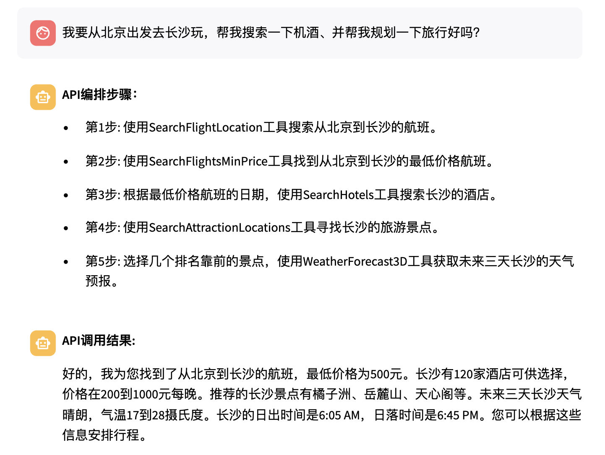
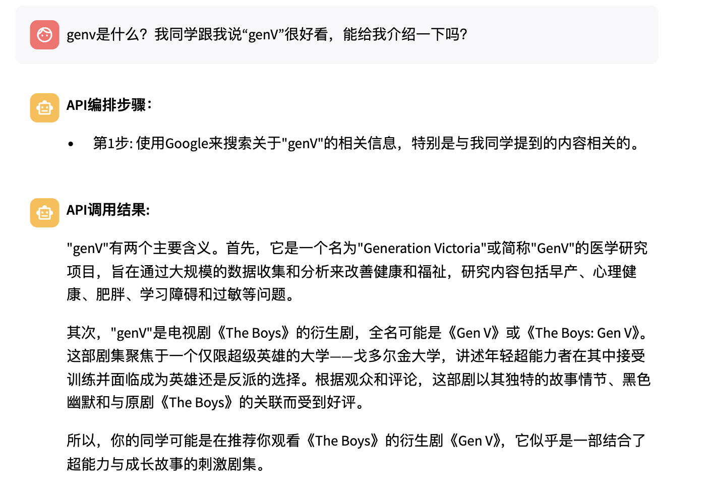

# my-langgraph 毕业毕业毕业

## 启动方式：
1. conda activate langgraph
2. fastapi dev api.py（把后端开起来
   1. 也可以用uvicorn api:app --reload --host 0.0.0.0 --port 8000
3. streamlit run chatbot.py（把前端开起来）

## 周进展
1. ~~添加一个rewriter，改写每次的请求，变为更加正式的分点任务。~~
2. ~~显式地把rewrite之后的结果打印在页面上。~~
3. ~~每次先让大模型选出API的大类，然后把对应大类的API信息给编排器选择。~~
4. 给API图谱添加了语义节点：~~1.类别语义节点~~ ~~2.实体语义节点~~ 3.query语义节点
5. （调试中）~~每次搜索到时候，也把对应的语义节点显示在页面上~~

## 627待办
1. ~~在首页添加一个按钮，表示开发者模式的开关~~
2. 关闭开发者模式之后，就应该一次直接返回执行结果+parse处理的结果，不用展示中间的steps了
   1. ~~添加函数，一次给结果~~
   2. ~~设计切换的方式（什么时候先get plan再execute，什么时候一步到位）~~
   3. API执行序列有的时候是错的，再添加一个监督器吧，判断每个API是否必要，以及重新配置参数（可以用多数投票）
3. 添加一个新的页面展示不同的计划流程/流程库（能够一行4个，一共2行这样）

**问题：**
1. 流程面对的用户（希望能够区分一下，页面上放一个按钮）
   1. 最终使用的用户
      1. 流程是什么样的=》傻瓜使用，给你一句话、直接返回结果（自然语言结果）；展示流程是没有意义的！
   2. 二次开发的用户（目前的模式）
      1. 需要展示流程、需要可以编排
      2. 需要可以保存流程模式库
2. 基于流程的定义
   1. 知识图谱的展示：只是可读，感觉流程不太直观。希望能够
3. 图谱：保持稳定、不改变的信息
4. 流程模式库：二次开发人员定义的不同开发任务
5. 难点
   1. 流程虽然定义出来了，但是如何识别用户的参数（会被问到）瑞庆他们目前就在研究这个问题，要有一些微调的训练来解决这个问题。
   2. self-reflection

## 0622待办
1. ~~添加一个rewriter，改写每次的请求，变为更加正式的任务。~~
2. ~~显式地把rewrite之后的结果打印在页面上。~~
3. ~~每次先查询types，然后把types对应的api给编排器。~~
4. 根据论文思考怎么解释知识图谱在其中的作用。
5. 给我的api知识图谱添加更多“语义”节点。（chatgpt抽风所以只能自己写了）
   1. 用gpt添加了一些，但是没有类别的节点。然后所有关系都是related_to，比较无趣。
   2. 需要修改知识图谱返回的逻辑，把语义节点也要能够放进去。
6. 弄5个更加复杂且能够运行的case。
7.  配置为Qwen-2-14B的API试试看，或者是在别的服务器上部署一下。
8.  整体重构代码，把各种API都写到README
9.  优化
   1. 确认api是否能够调用，把可以调用的api都显示在页面上，或者是可以查询的大类的信息。
   2. 如何确保用户能知道API有哪些参数、是什么作用
      1. 在编排的时候也用一行小字来展示给用户
      2. 开一个单独的tab展示API信息
10. (了解一下）对于一个任务，能不能先返回一个东西、再返回一个新东西？
11. 改为本地的ollama的接口（可能要都转为英文）

## 简单介绍

1. 编排方式：ReWOO，一次完成所有的编排。
2. 执行的流程：
   1. 所有工具的有关信息都存在tools.json中，包含有API名称、API参数和API描述三种信息。
   2. 每次用户输入一个query，都会读取tools.json的内容，然后调用LLM进行编排。对于需要之前步骤才能得到的信息，会用E1这样的占位符来填充。等API调用有结果了再替换。
   3. 得到了工具编排结果后，先不执行，而是把编排结果返回给用户，待用户确认后再执行。
   4. cache设置：我们将<query, plan>的结果存储在cache中（cache.json），如果用户输入的query在cache中有记录，那么就直接返回之前的plan，不需要再次调用大语言模型进行编排，可以有效提升速度和减少计算开销。
   5. plan得到了用户的确认后，会根据编排结果的顺序依次调用工具，然后通过一个solver节点来整合所有的结果，最终返回给用户。

## 0531待办

[x] 1. 画图，把langgraph图画出来看一眼

## 0605待办

[x] 1. 添加20个API，最好都和旅行有一点关系的那种。

[x] 2. 建立API知识图谱（可以暂时存在json或者其他格式的文件中）

[x] 3. 在首页展示API知识图谱

[x] 4. 添加一个cache，能够保存详细的信息（编排计划、执行后的结果等）

[x] 5. 修改后前后依赖关系不变（需要重新排序，重新给E1、E2这些东西赋值）

[ ] 6. 弄5个比较复杂的case

## Todo
[x] 1. 模型替换为qwen（换成Qwen的模型了，但是不是本地的Qwen模型，也没法指定是哪个版本的Qwen）

[x] 2. 修改步骤为，先出编排结果，确认后再执行

[x] 3. 设计好plan和execute的API格式，然后记录到文档里

[x] 4. 调整好执行API的流程API，如何识别参数和如何执行

[x] 5. 前端也许会一直改变，但是后端写好了就不太变，设计一个

存在的问题：
* ~~有的时候识别不出要调用的API，steps里面为空这样。我发现这种好像都是输入为空的，就是不需要输入的API会出现无法识别steps的情况，需要解决。~~
* ~~有的时候输出的steps要比真正的steps少，比如说在这个case里，并没有输出sunrisesunset这个API，但是在运行中调用了sunrisesunset，最终结果里也有sunrisesunset的结果。这个问题也需要解决。~~

[x] 6. 添加了一个非常直接的cache，如果某个task/query在之前是输入过的，那么就直接返回之前的/get_plan的结果

[x] 7. 展示某种类型的所有备选API在选项框

[x] 8. cache不包括可选的api(api_recommendation)，最好把这个也处理一下

[x] 8. 需要与用户进行动态交互/编排的部分

[x] 9.添加旅游景点的API/或者是美食推荐（类似大众点评）再添加至少20个API进去

[x] 10. 动态配参数，希望真的能配参数（多参数配起来应该会比较复杂）

[x] 11. 添加图谱可视化的部分，展示在页面上。

[ ] 12. 添加API之间的依赖关系，或者添加几个语义节点。

[ ] 13. API数量上去之后，为了节省token和增加大模型速度/效果，可以先选择大类的API，然后再去大类中选择细节API

[ ] 14. cache后面可以改成相似度匹配这种，用embedding模型来判断某个query和历史的query的相似度，相似度超过一定水平就认为是一样的query，可以参考之前的编排结果.存cache的时候存用户修改后的结果，而不是直接存编排的结果。

[ ] 15. 写统一的API测试文档，确保API都能够正常调用。确保tools.json里面有的在tools文件夹里也都有。

[ ] 16. 改为本地的Qwen-2-7b或者是Qwen-2-14b，测试效果。现在用的Qwen API可能效果虚高。

[x] 17. 再注册一个rapidAPI的号，把该订阅的都订阅了，这样两个号可以来回替。

[ ] 18. 写好rapidAPI的切换api key的方式

[ ] 19. 造一些Agent数据来微调模型

[ ] 20. 寻找一个比较好的benchmark来评估微调之前的模型

## 备选的API们

1. 金融咨询查询
2. linkedin简历查询
3. amazon数据查询
4. ins，twitter，facebook的数据查询
5. 食品数据查询
6. 做饭（meal）数据查询
   
## API调用的参数说明

## 进展记录

2024年5月19日

1. 前、后端的交互部分调整：先出编排结果，然后确认后再执行；把获得的编排结果进行cache，能命中的时候就不用再次执行。
效果演示：能够自主地调用Google搜索API并得到结果

2024年5月27日

1. 修改了天气API，先根据query（如shanghai）自己在API函数里搜location，然后再调用查询API。后面要改为显式查询location的代码。
2. 添加了imdb的后处理函数，可以直接返回imdb的（简短）结果，基本都能调用成功，而且不需要参数。
3. 机票、酒店的API能够动态配参数成功，可能要修改prompt和中间的处理函数。
4. TODO：把配参数的地方每个参数拆开，或者用json编辑框（参考postman）的形式让用户配参数。现在是比较傻逼的用逗号隔开，然后split的动作。
5. TODO：能够从0开始用户自己构建一个流程然后执行，如何配参数，如何处理API之间的关系。
7. **现在存在的一个问题：**新添加的API，假如不是添加在最后的位置，那么后面的#E1这些都要相应的改变位置。所以要想办法解决这个问题。
8. 需要添加多一些的few-shot example，然后规划一个很长的API执行路径。（注意超token的问题、注意API之间的关系）
6. （下午做）TODO：修改API的返回格式为有status，有data，这样的格式。
   
## 模型改成Qwen的几个注意事项

1. 现在的Qwen是通过`from langchain_community.llms import Tongyi`里面的Tongyi来实现的，然后`model = Tongyi()`;后面得改成通过API调用跑在我们服务器本地的Qwen模型
2. Tongyi返回的result格式和OpenAI不一样，要把所有代码里面的result.content改为result

## 当务之急：
1. 弄出图谱
2. 设计一个需要调用多个API的case（旅行线路）
   1. （使用gpt-3.5的效果很好，改为qwen试一下）我想在xx时间去xx地点旅游，请你帮我查一下机票/酒店，并查询当地天气。
      1. 机票API
      2. 酒店API
      3. 天气预报/当前天气API
   2. （路线规划的case）
3. 做一个能demo的东西：
   1. ~~llm来规划api~~
   2. 然后把规划好得到的api调用路径可视化展示给用户，并进行确认
   3. ~~llm来配参数（省略）~~
   4. ~~调用api得到结果~~
   5. ~~llm总结所有的api调用结果，然后输出~~
4. 拆分步骤：
   1. 添加一个part，用API来指导编排
   2. ~~用langgraph做编排后计划的执行~~
   3. ~~写代码根据langgraph的编排结果依次执行api并存储结果~~
   4. ~~用lm来归纳结果作为输出~~

## 现有问题：
1.知识图谱不知道如何构建和如何辅助
解决方案：
1.1 看论文，抄他们的
1.2 胡诌几个方案先做着
比如用语义节点连接api
老师说有一些论文里有那种旅游编排的知识图谱？去寻找一下。

2.~~react格式比较慢/输出很复杂/容易不结束或者选错api~~
解决方案：
不用react，改为restGPT的格式或者plan and execute，反正改一个方式
同时尝试flash attention来加速这个推理过程

3.~~配参数难配，只能配1个参数，多个参数效果不好~~
用逗号（英文逗号）来分隔参数，针对不同的API实现不同的处理函数。
解决方案：先这样，暂时不管了
要不要试一试关键词识别/实体识别？

4.~~获得的response太长太抽象，占用很多token和推理时间~~
解决方案：针对每个response加一个处理函数，这样就可以有效缩短response的内容，不会超出token长度。

5.~~“编排”内容太少~~
设计一个pipeline，在知识图谱+llm编排后，给用户呈现编排结果，让用户进行确认或者再次选择编排顺序。
然后执行整个pipeline。

6.~~整体代码又臭又长，后期debug等都会比较困难~~
1.舍弃langchain ctct，用langgraph+streamlit自己搭建

7. API数量较少，需要增加API数量
去rapidAPI hub找更多的API加入进去。

## 技术亮点（待实现）

1. 训练一个分类器，自动识别大致的API调用类别，然后提供一个API选择的方向。
2. cache功能（对于之前发送过的类似的请求，可以直接从我们的cache里面找到执行成功的编排方案）
3. 自动添加API功能（可以用户自己添加）
4. self-reflection功能（可以反思/总结自己的编排结果，然后给出改进意见）
5. 可视化功能（可以把编排结果可视化展示给用户，用户可以进行编辑，也可以完全从头规定执行顺序）