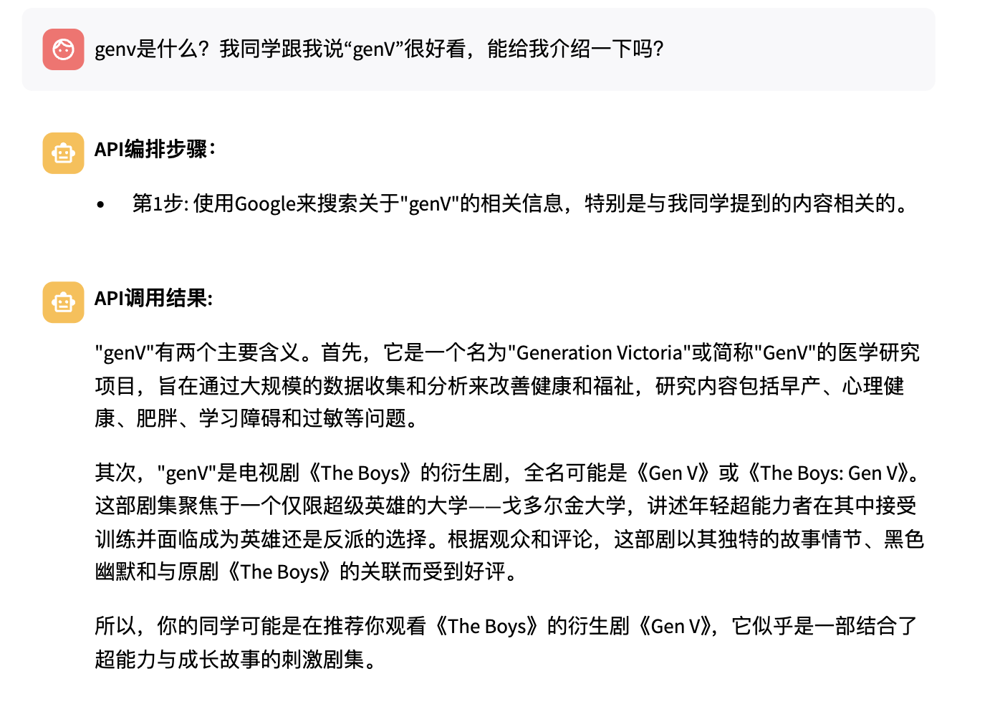

# TODO

## 长期TODO（已完成）

1. ~~模型替换为qwen（换成Qwen的模型了，但是不是本地的Qwen模型，也没法指定是哪个版本的Qwen）~~

2. ~~修改步骤为，先出编排结果，确认后再执行~~

3. ~~设计好plan和execute的API格式，然后记录到文档里~~

4. ~~调整好执行API的流程API，如何识别参数和如何执行~~

5. ~~前端也许会一直改变，但是后端写好了就不太变，设计一个~~

存在的问题：
* ~~有的时候识别不出要调用的API，steps里面为空这样。我发现这种好像都是输入为空的，就是不需要输入的API会出现无法识别steps的情况，需要解决。~~
* ~~有的时候输出的steps要比真正的steps少，比如说在这个case里，并没有输出sunrisesunset这个API，但是在运行中调用了sunrisesunset，最终结果里也有sunrisesunset的结果。这个问题也需要解决。~~

6. ~~添加了一个非常直接的cache，如果某个task/query在之前是输入过的，那么就直接返回之前的/get_plan的结果~~

7. ~~展示某种类型的所有备选API在选项框~~

8. ~~cache不包括可选的api(api_recommendation)，最好把这个也处理一下~~

8. ~~需要与用户进行动态交互/编排的部分~~

9.~~添加旅游景点的API/或者是美食推荐（类似大众点评）再添加至少20个API进去~~

10. ~~动态配参数，希望真的能配参数（多参数配起来应该会比较复杂）~~

11. ~~添加图谱可视化的部分，展示在页面上。~~

12. ~~添加API之间的依赖关系，或者添加几个语义节点。~~

13. ~~API数量上去之后，为了节省token和增加大模型速度/效果，可以先选择大类的API，然后再去大类中选择细节API.~~

## 0622待办
1. ~~添加一个rewriter，改写每次的请求，变为更加正式的任务。~~
2. ~~每次先查询types，然后把types对应的api给编排器。~~
3. 根据论文思考怎么解释知识图谱在其中的作用。
4. 给我的api知识图谱添加更多“语义”节点。（chatgpt抽风所以只能自己写了）
   1. 用gpt添加了一些，但是没有类别的节点。然后所有关系都是related_to，比较无趣。
   2. 需要修改知识图谱返回的逻辑，把语义节点也要能够放进去。
5. ~~显式地把rewrite之后的结果打印在页面上。~~
6. 弄5个更加复杂且能够运行的case。
8.  配置为Qwen-2-14B的API试试看，或者是在别的服务器上部署一下。
9.  整体rewoo的代码
10. ~~把各种API都写到README~~
11. 进阶任务
   1. 确认api是否能够调用，把可以调用的api都显示在页面上，或者是可以查询的大类的信息。
   2. 如何确保用户能知道API有哪些参数、是什么作用
      1. 在编排的时候也用一行小字来展示给用户
      2. 开一个单独的tab展示API信息
    3.  对于一个任务，能不能先返回一个东西、再返回一个新东西？
    4.  改为本地的ollama的接口（可能要都转为英文）

## 0605待办

1. 添加20个API，最好都和旅行有一点关系的那种。

2. 建立API知识图谱（可以暂时存在json或者其他格式的文件中）

3. 在首页展示API知识图谱

4. 添加一个cache，能够保存详细的信息（编排计划、执行后的结果等）

5. 修改后前后依赖关系不变（需要重新排序，重新给E1、E2这些东西赋值）

## 0531待办

1. 画图，把langgraph图画出来看一眼

## 0527待办

1. 修改了天气API，先根据query（如shanghai）自己在API函数里搜location，然后再调用查询API。后面要改为显式查询location的代码。
2. 添加了imdb的后处理函数，可以直接返回imdb的（简短）结果，基本都能调用成功，而且不需要参数。
3. 机票、酒店的API能够动态配参数成功，可能要修改prompt和中间的处理函数。
4. TODO：把配参数的地方每个参数拆开，或者用json编辑框（参考postman）的形式让用户配参数。现在是比较傻逼的用逗号隔开，然后split的动作。
5. TODO：能够从0开始用户自己构建一个流程然后执行，如何配参数，如何处理API之间的关系。
7. **现在存在的一个问题：**新添加的API，假如不是添加在最后的位置，那么后面的#E1这些都要相应的改变位置。所以要想办法解决这个问题。
8. 需要添加多一些的few-shot example，然后规划一个很长的API执行路径。（注意超token的问题、注意API之间的关系）
6. （下午做）TODO：修改API的返回格式为有status，有data，这样的格式。

## 0519待办

1. 前、后端的交互部分调整：先出编排结果，然后确认后再执行；把获得的编排结果进行cache，能命中的时候就不用再次执行。
效果演示：能够自主地调用Google搜索API并得到结果

